# Hired – Visual Gallery

Visual walkthrough of the Hired job platform.

## Public Pages

### Home
Landing page with featured jobs and navigation.

- Hero with call-to-action
- Quick access to browse and auth

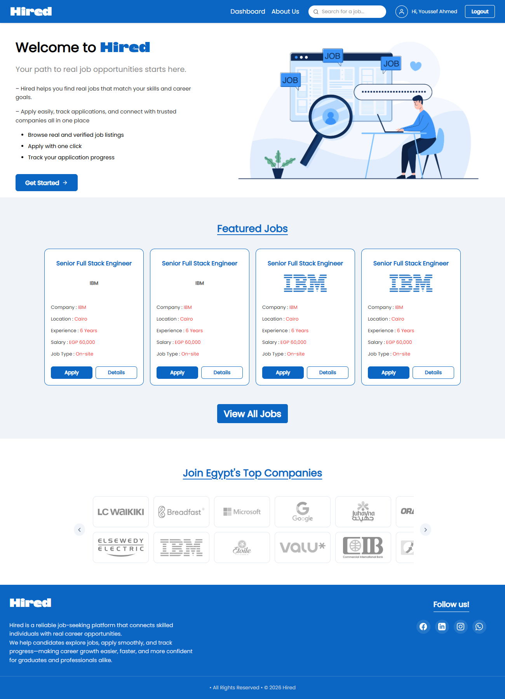

### Browse Jobs
Job discovery with listings and filters.

- Search/browse cards
- Location/category cues

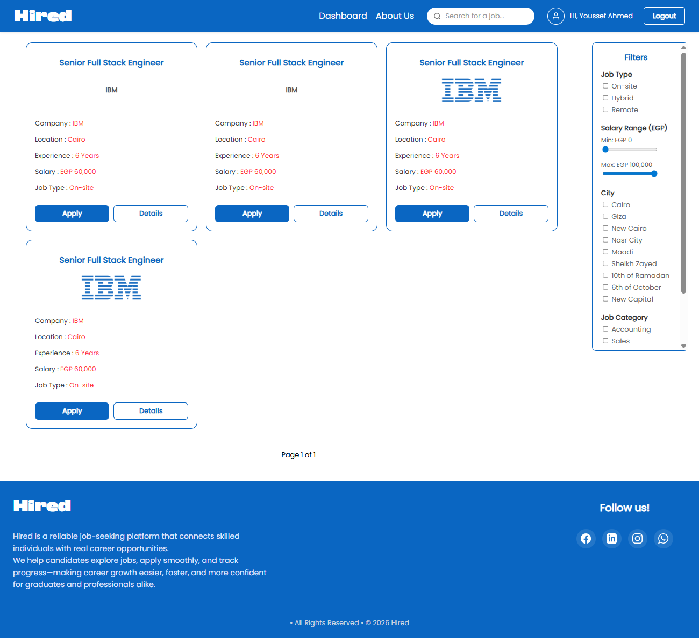

### Job Details
Full job description and apply entry point.

- Role/company summary
- Requirements and actions

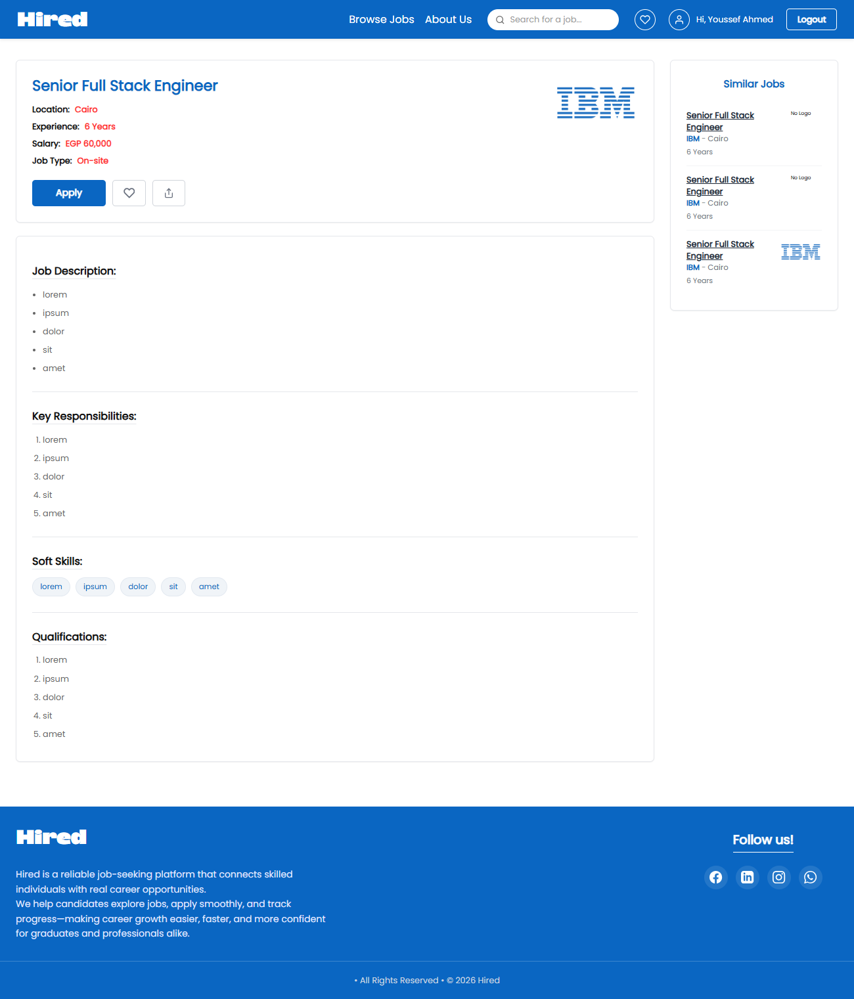

---

## Authentication

### Login
Single-step login for seekers and providers.

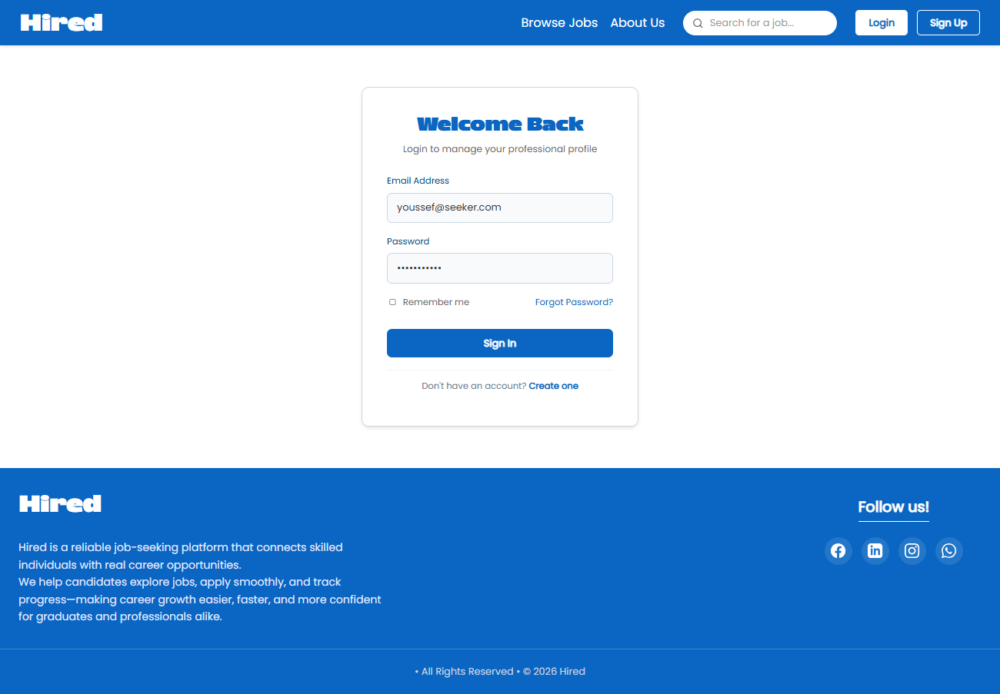

### Sign Up
Choose seeker or provider path.

<table>
  <tr>
    <td width="50%">
      <strong>Job Seeker</strong> 
      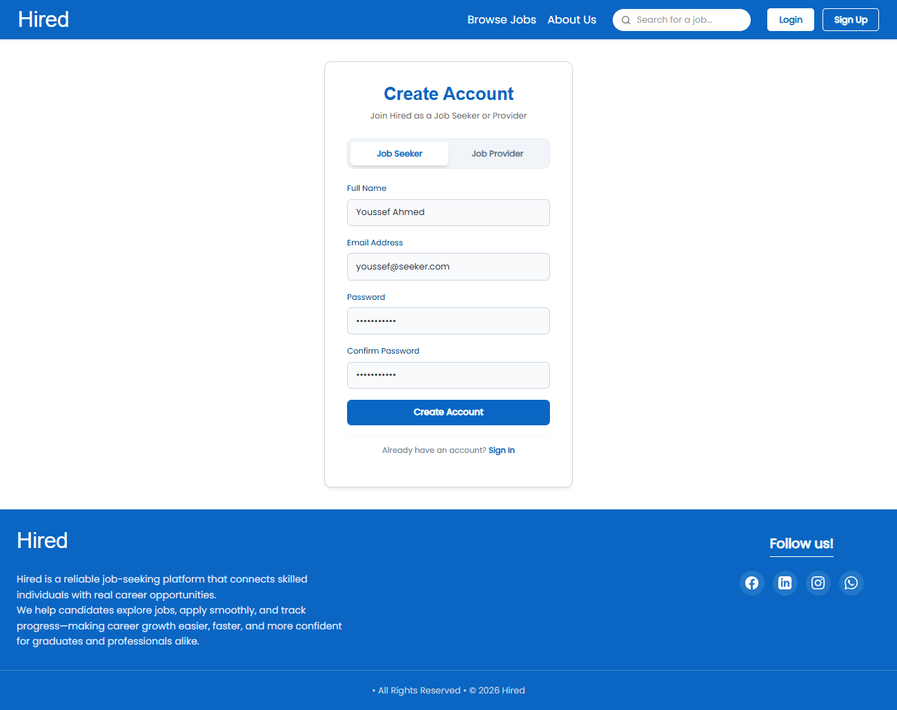
    </td>
    <td width="50%">
      <strong>Job Provider</strong> 
      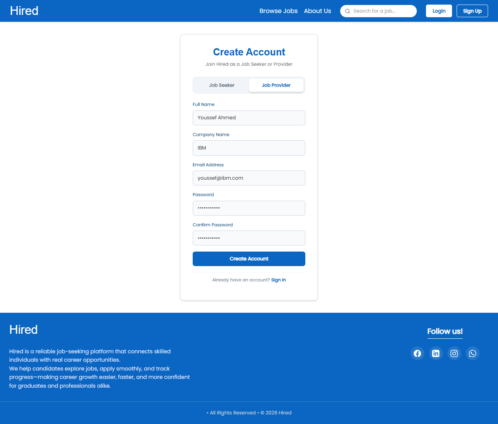
    </td>
  </tr>
</table>

---

## Job Discovery & Applications

### Wishlist (Empty / Filled)
Manage saved jobs.

- Empty state guidance
- Saved items view

<table>
  <tr>
    <td width="50%">
      <strong>Empty Wishlist</strong> 
      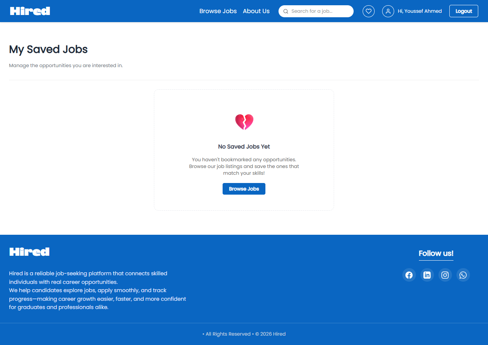
    </td>
    <td width="50%">
      <strong>Wishlist</strong> 
      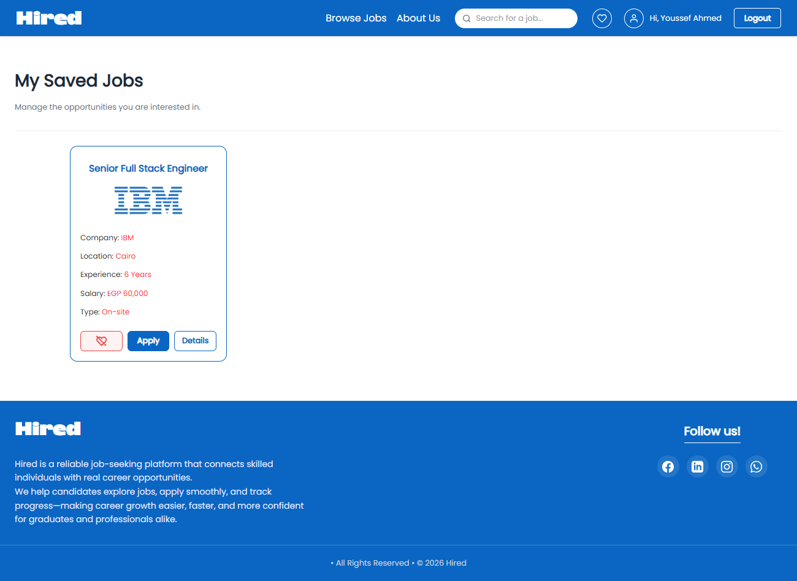
    </td>
  </tr>
</table>

### Apply for Job
Modal flow to submit an application.

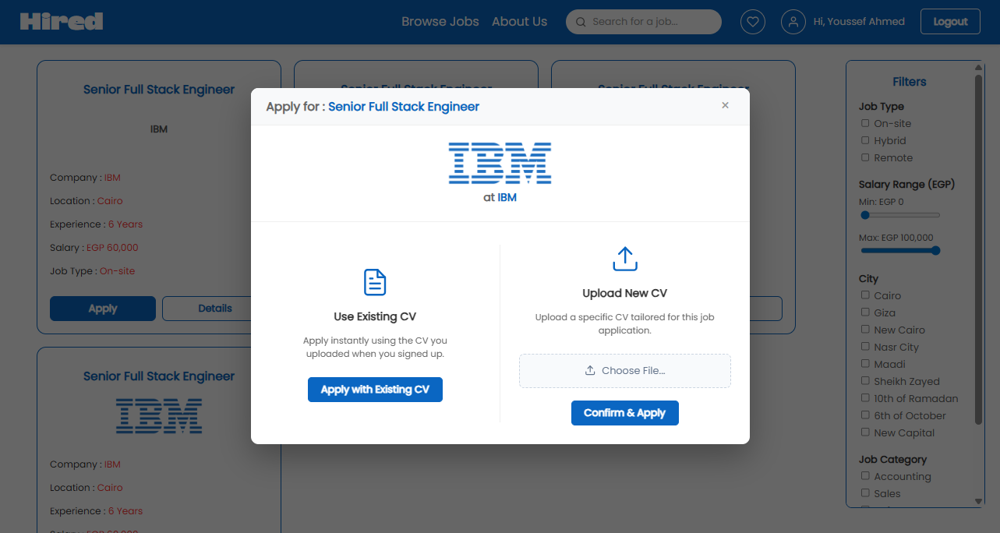

---

## User Dashboard

### Profile
Personal info, skills, and activity.

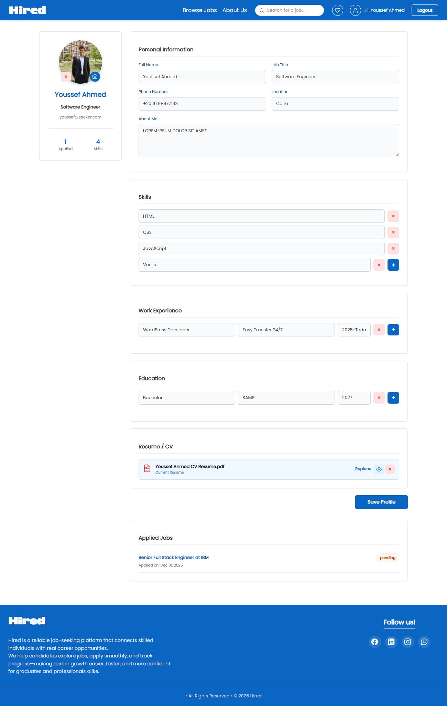

### Profile – Applied Job Accepted
Status view for accepted applications.

.png)

---

## Provider Dashboard

Comprehensive tools for job providers.

### Post a Job
Create a new listing.

.png)

### Manage Jobs
Oversee published roles.

.png)

### Applications
Review applicants per role.

.png)

### Application Accepted
Track accepted candidates.

.png)

---

## About Us
Team/mission overview.

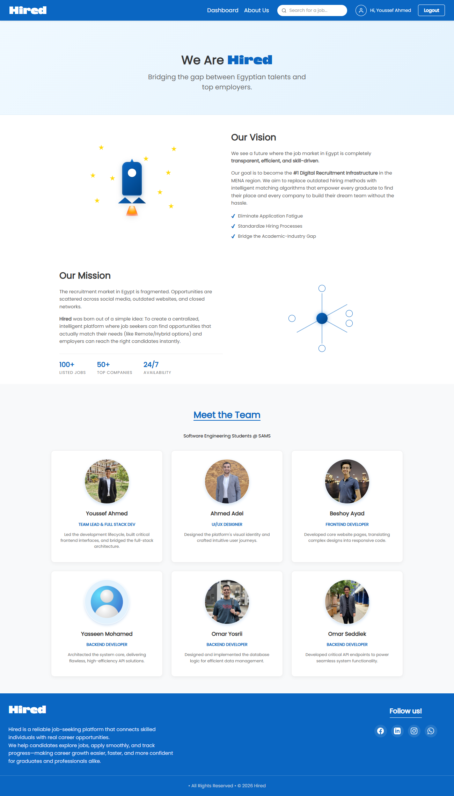
